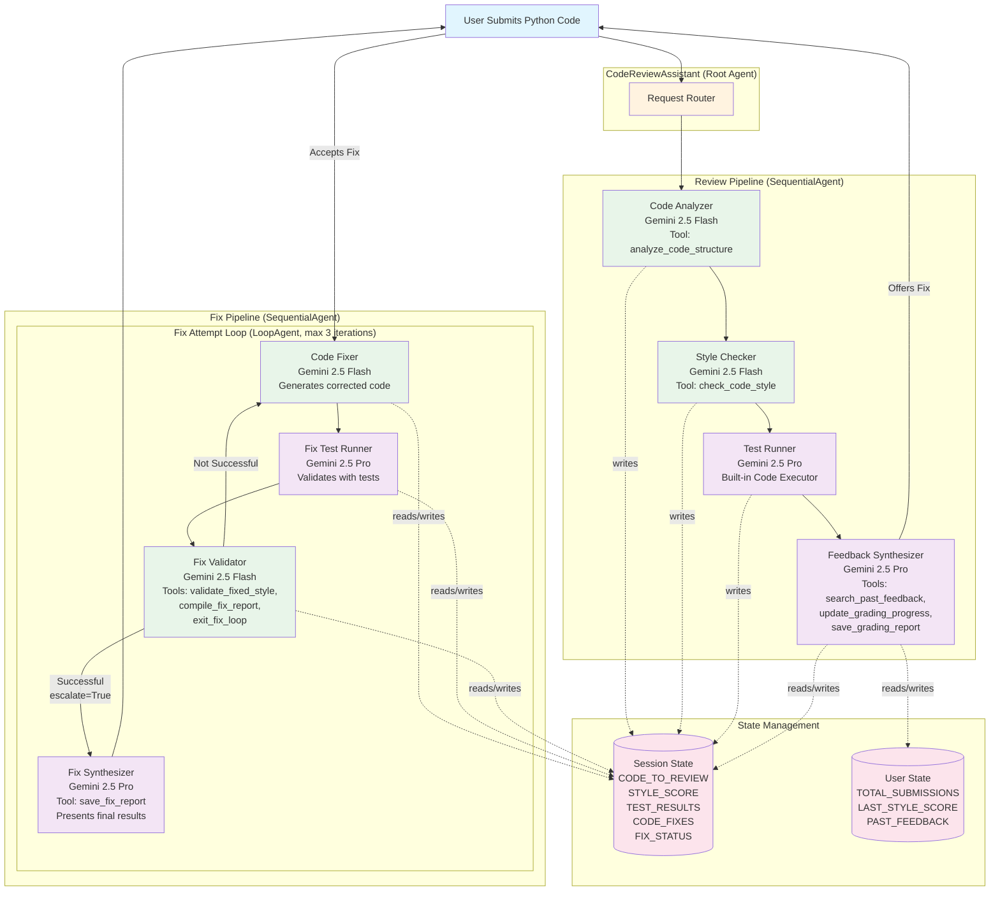

# 🎓 Code Review Assistant

An intelligent, multi-agent code review system powered by Google ADK and Gemini models. This assistant provides comprehensive Python code analysis including structure evaluation, PEP 8 style checking, automated testing, personalized feedback with improvement tracking, and automated code fixing through iterative refinement.


## 🌟 Features

### Core Capabilities
- **Code Structure Analysis**: Parse and analyze Python code structure using AST, identifying functions, classes, imports, and structural issues
- **PEP 8 Style Checking**: Validate code against Python style guidelines with detailed violation reports and weighted scoring
- **Automated Testing**: Generate and execute comprehensive test cases (15-20 per submission) using built-in code execution
- **Personalized Feedback**: Provide constructive, encouraging feedback that adapts based on submission history
- **Automated Code Fixing**: Iteratively fix identified issues through a loop architecture with validation
- **Progress Tracking**: Monitor improvement over time with persistent grading history
- **Multi-Attempt Support**: Allow multiple submission attempts with incremental guidance

### Technical Features
- Dual-pipeline architecture (Review + Fix) using Sequential and Loop agents
- Configurable LLM models (Gemini 2.5 Flash for tasks, Gemini 2.5 Pro for complex reasoning)
- Session persistence with Vertex AI managed sessions or custom backends
- Artifact management for reports and feedback history
- Production deployment support for Agent Engine, Cloud Run, and GKE
- Built-in observability with Cloud Trace integration

## 🏛️ Architecture

The Code Review Assistant uses a sophisticated dual-pipeline architecture with specialized agents:



### Architecture Components

#### **Main Orchestrator**
- **CodeReviewAssistant**: Entry point that routes user input to appropriate pipeline
- Delegates to **CodeReviewPipeline** for initial analysis
- Offers **CodeFixPipeline** if issues are identified
- Manages overall session state and user interaction

#### **Review Pipeline (SequentialAgent)**

Analyzes code through four specialized agents in sequence:

1. **Code Analyzer Agent** (Gemini 2.5 Flash)
   - Uses `analyze_code_structure()` tool
   - Parses Python code using AST
   - Identifies functions, classes, imports, docstrings
   - Calculates complexity metrics
   - Stores analysis in session state
   
2. **Style Checker Agent** (Gemini 2.5 Flash)
   - Uses `check_code_style()` tool
   - Validates PEP 8 compliance via pycodestyle
   - Checks naming conventions
   - Calculates weighted style score (0-100)
   - Reports violations with line numbers
   
3. **Test Runner Agent** (Gemini 2.5 Pro)
   - Uses built-in code executor
   - Generates 15-20 comprehensive test cases
   - Executes tests in sandboxed environment
   - Returns structured JSON results
   - Identifies critical issues vs expected behavior
   
4. **Feedback Synthesizer Agent** (Gemini 2.5 Pro)
   - Uses `search_past_feedback()` tool for history
   - Uses `update_grading_progress()` for metrics
   - Uses `save_grading_report()` for artifacts
   - Combines all analysis results
   - Generates personalized, educational feedback
   - Tracks improvement over time

#### **Fix Pipeline (SequentialAgent + LoopAgent)**

Automatically fixes identified issues through iterative refinement:

**FixAttemptLoop** (LoopAgent, max 3 iterations):
1. **Code Fixer Agent** (Gemini 2.5 Flash)
   - Generates corrected Python code
   - Addresses style violations, bugs, and logic errors
   - Outputs raw Python (no markdown)
   
2. **Fix Test Runner Agent** (Gemini 2.5 Pro)
   - Executes same tests on fixed code
   - Returns structured JSON with pass/fail metrics
   - Compares results to original baseline
   
3. **Fix Validator Agent** (Gemini 2.5 Flash)
   - Uses `validate_fixed_style()` tool
   - Uses `compile_fix_report()` tool
   - Determines fix status: SUCCESSFUL/PARTIAL/FAILED
   - Calls `exit_fix_loop()` if successful (sets escalate=True)
   - Otherwise, loop continues for another iteration

**Fix Synthesizer Agent** (Gemini 2.5 Pro):
- Runs once after loop completes
- Uses `save_fix_report()` tool
- Presents final fix results with before/after comparison
- Provides educational explanations of changes
- Shows complete corrected code

#### **Tool Functions**

**Review Pipeline Tools:**
- `analyze_code_structure(code, tool_context)`: AST-based code parsing and metrics
- `check_code_style(code, tool_context)`: pycodestyle integration with weighted scoring
- `search_past_feedback(developer_id, tool_context)`: Historical feedback retrieval from memory
- `update_grading_progress(tool_context)`: Progress tracking across session/user/lifetime tiers
- `save_grading_report(feedback_text, tool_context)`: Artifact generation for reports

**Fix Pipeline Tools:**
- `validate_fixed_style(tool_context)`: Style validation for corrected code
- `compile_fix_report(tool_context)`: Comprehensive fix attempt analysis
- `exit_fix_loop(tool_context)`: Loop exit signal (sets escalate=True)
- `save_fix_report(tool_context)`: Fix artifact generation

#### **State Management**

- **Session State**: Temporary data for current review (CODE_TO_REVIEW, STYLE_SCORE, TEST_RESULTS)
- **User State**: Persistent history (USER_TOTAL_SUBMISSIONS, USER_LAST_STYLE_SCORE)
- **StateKeys Constants**: Type-safe state access pattern prevents typos
- **Artifact Storage**: JSON reports saved via Vertex AI artifact service or GCS

## 📋 Prerequisites

- Python 3.10 or higher
- Google Cloud Project with billing enabled
- `gcloud` CLI installed and authenticated
- Git for version control

## 🚀 Quick Start

### 1. Clone the Repository

```bash
git clone https://github.com/ayoisio/code-review-assistant.git
cd code-review-assistant
```

### 2. Set Up Environment

```bash
# Create virtual environment
python -m venv .venv
source .venv/bin/activate  # On Windows: .venv\Scripts\activate

# Install dependencies
pip install -r code_review_assistant/requirements.txt
```

### 3. Configure Environment Variables

```bash
# Copy the example environment file
cp .env.example .env

# Edit .env with your settings
nano .env  # or use your preferred editor
```

Required configuration:
```bash
GOOGLE_CLOUD_PROJECT=your-project-id
GOOGLE_CLOUD_LOCATION=us-central1
GOOGLE_GENAI_USE_VERTEXAI=true
```

### 4. Run the Assistant Locally

```bash
# Run with in-memory sessions (development)
./deploy.sh local
```

Navigate to `http://localhost:8080` in your browser.

## 🏗️ Project Structure

```
code-review-assistant/
├── code_review_assistant/
│   ├── __init__.py
│   ├── agent.py                 # Main orchestration (root agent + pipelines)
│   ├── config.py                # Configuration management
│   ├── constants.py             # StateKeys constants
│   ├── tools.py                 # Tool implementations
│   └── sub_agents/
│       ├── review_pipeline/
│       │   ├── __init__.py
│       │   ├── code_analyzer.py
│       │   ├── style_checker.py
│       │   ├── test_runner.py
│       │   └── feedback_synthesizer.py
│       └── fix_pipeline/
│           ├── __init__.py
│           ├── code_fixer.py
│           ├── fix_test_runner.py
│           ├── fix_validator.py
│           └── fix_synthesizer.py
├── tests/
│   ├── test_agent_engine.py     # Agent Engine deployment test
│   └── ...
├── deploy.sh                     # Unified deployment script
├── .env.example                  # Environment variable template
├── requirements.txt              # Python dependencies
└── README.md                     # This file
```

## 🔧 Configuration

### Model Selection

The assistant uses two Gemini models configured in `config.py`:

```python
# Fast model for mechanical tasks (analysis, style checking, fixing)
worker_model = "gemini-2.5-flash"

# Advanced model for complex reasoning (testing, synthesis)
critic_model = "gemini-2.5-pro"
```

### Session Management

Agent Engine deployments use Vertex AI managed sessions automatically. For local development or Cloud Run, configure in `.env`:

```bash
# Local development (in-memory, ephemeral)
# No SESSION_SERVICE_URI needed - handled by deploy.sh

# Cloud Run (PostgreSQL via Cloud SQL)
# Automatically configured by deploy.sh
```

## 🎯 Usage Examples

### Basic Code Review

Submit code through the web interface or API:

```python
def calculate_average(numbers):
    total = 0
    for num in numbers:
        total += num
    return total / len(numbers)
```

The assistant will:
1. Analyze structure (1 function, no classes)
2. Check PEP 8 compliance (score: 85/100 - missing docstring)
3. Generate and run 15-20 tests (finds edge case: crashes on empty list)
4. Provide comprehensive feedback with specific improvements

### Automated Fixing

After receiving review feedback, user responds "yes" when offered fixes. The fix pipeline will:

1. **Iteration 1**: Add docstring, fix edge case → tests: 18/20 passed
2. **Iteration 2**: Fix remaining edge cases → tests: 20/20 passed, style: 100/100
3. **Exit**: Escalate triggered, synthesizer presents final corrected code

### API Usage

```python
import requests

# Submit code for review
response = requests.post(
    "http://localhost:8080/run_sse",
    json={
        "app_name": "code_review_assistant",
        "user_id": "developer_001",
        "session_id": None,  # Auto-creates new session
        "new_message": {
            "role": "user",
            "parts": [{"text": "Review this code:\n\ndef add(a,b):return a+b"}]
        },
        "streaming": False
    }
)

print(response.json())
```

## 🚢 Deployment

The unified `deploy.sh` script handles all deployment scenarios:

### Local Development

```bash
# Run with in-memory sessions and hot reload
./deploy.sh local
```

### Cloud Run (Serverless with Persistence)

```bash
# Deploy with Cloud SQL for session persistence
./deploy.sh cloud-run
```

What the script handles automatically:
- Enables required APIs (Cloud Run, Cloud SQL, Cloud Build, etc.)
- Creates Cloud SQL instance if not exists
- Generates secure database credentials
- Sets up IAM permissions
- Deploys with ADK CLI
- Configures Cloud SQL connection

### Vertex AI Agent Engine (Fully Managed)

```bash
# Deploy to Agent Engine with managed sessions
./deploy.sh agent-engine
```

What the script handles automatically:
- Enables required APIs (AI Platform, Storage, Cloud Trace)
- Creates staging and artifact buckets
- Sets up IAM permissions
- Deploys with ADK CLI and trace-to-cloud flag
- Returns Agent Engine ID for future updates

Save the returned Agent Engine ID in `.env`:
```bash
AGENT_ENGINE_ID=7917477678498709504
```

### Testing Deployed Agent

```bash
# Test Agent Engine deployment
python tests/test_agent_engine.py
```

## 🧪 Testing

### Manual Testing

Use the sample buggy code to test the complete review + fix flow:

```python
def dfs(graph, start):
    """Performs depth-first search on a graph."""
    visited = set()
    stack = start  # Bug: should be [start]
    
    while stack:
        current = stack.pop()
        if current not in visited:
            visited.add(current)
            stack.extend(graph[current])  # Bug: KeyError if key missing
    
    return visited
```

Expected behavior:
1. Review pipeline identifies: AttributeError (can't .pop() on string), potential KeyError
2. Offer to fix
3. Fix loop corrects both issues in 1-2 iterations
4. Final code passes all tests with 100/100 style score

## 📊 Monitoring and Observability

### Cloud Trace Integration

When deployed with `--trace-to-cloud`, every request generates detailed traces showing:

- Complete request timeline from input to response
- Individual agent executions with durations
- Tool function calls with inputs/outputs
- LLM requests with token counts
- Loop iterations in fix pipeline
- State operations (read/write)

Access traces:
1. Navigate to [Cloud Trace Explorer](https://console.cloud.google.com/traces)
2. Select your project
3. Click on traces to view waterfall charts

### View Logs

```bash
# Agent Engine logs
gcloud logging read "resource.type=aiplatform.googleapis.com/ReasoningEngine \
    AND resource.labels.reasoning_engine_id=$AGENT_ENGINE_ID" \
    --limit=50

# Cloud Run logs
gcloud logging read "resource.type=cloud_run_revision \
    AND resource.labels.service_name=code-review-assistant" \
    --limit=50
```

## 📚 Additional Resources

- [ADK Documentation](https://google.github.io/adk-docs/)
- [Agent Engine Guide](https://cloud.google.com/vertex-ai/generative-ai/docs/agent-engine/overview)
- [Cloud Run Documentation](https://cloud.google.com/run/docs)
- [Cloud Trace Documentation](https://cloud.google.com/trace/docs)

---

Built with ❤️ using Google ADK and Gemini
